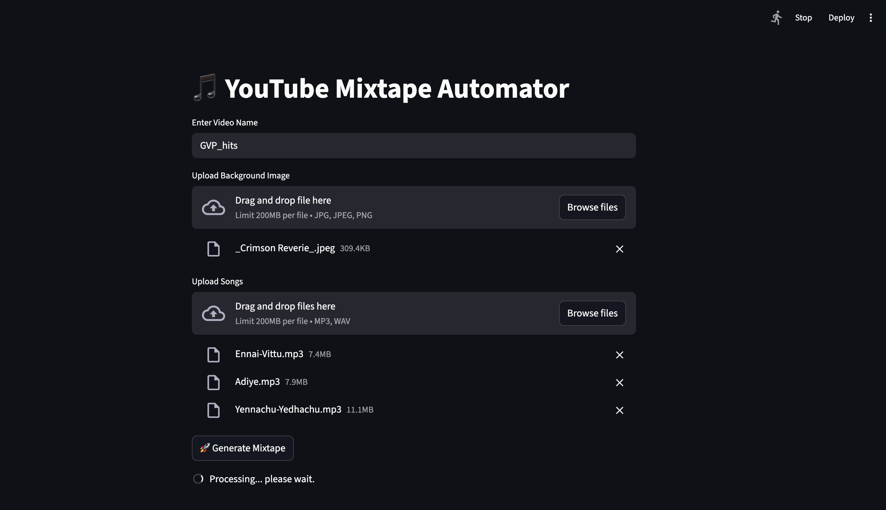
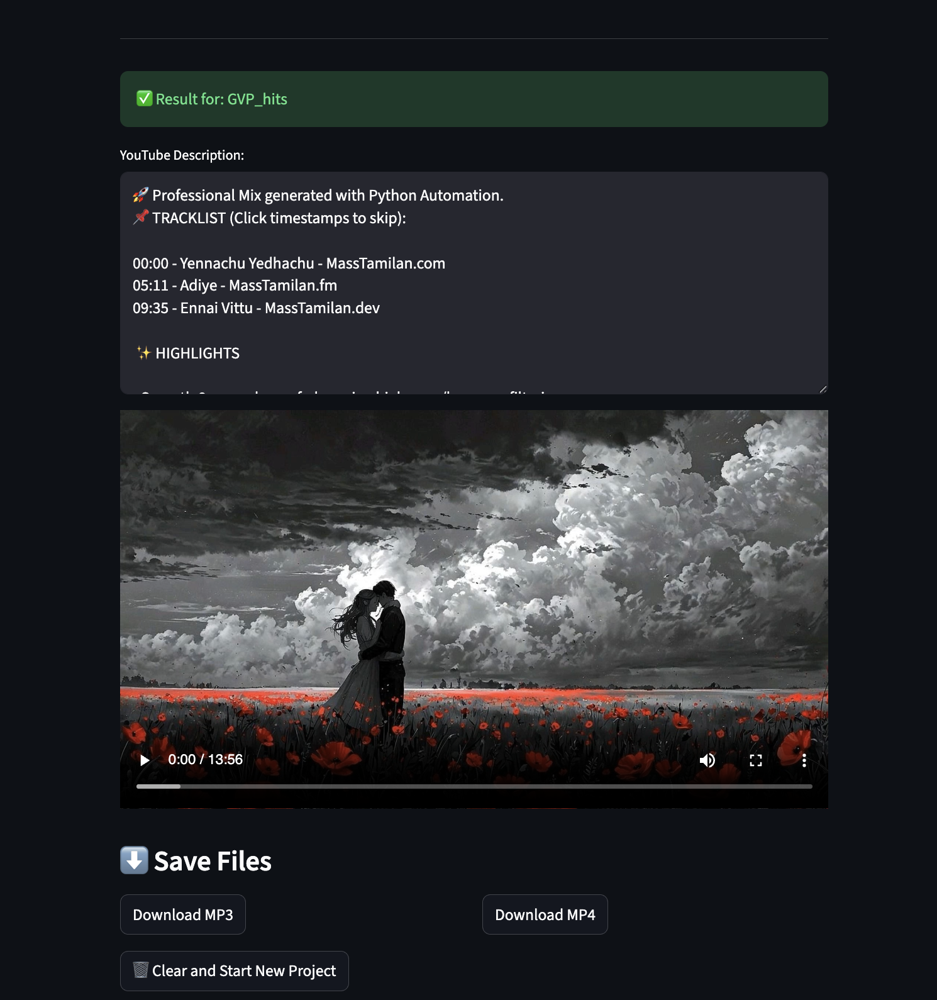

# 🎵 YouTube Mixtape Pro-Automator

An end-to-end Python application that transforms a collection of audio files and a single image into a professional, seamless YouTube mixtape. Featuring AI-powered "Pro DJ" transitions, automatic timestamp generation, and high-speed video rendering.

## 📱 App Overview
|  |   |

## ✨ Features
* **Pro DJ Transitions:** Uses High-Pass/Low-Pass filtering and constant power crossfading to ensure no volume dips or frequency clashing between songs.
* **Auto-Metadata:** Generates a YouTube-ready description with clickable timestamps (Chapters) automatically calculated from track durations.
* **Fast Rendering:** Leverages FFmpeg for ultra-fast "Still Image" MP4 generation.
* **Modern UI:** A clean Streamlit interface with a "Persistent Memory" state, allowing for downloads without page refreshes.
* **Modular API:** Built with FastAPI, separating audio/video processing from the front-end interface.

## 🛠️ Tech Stack
* **Frontend:** [Streamlit](https://streamlit.io/)
* **Backend:** [FastAPI](https://fastapi.tiangolo.com/)
* **Audio Engine:** [Pydub](http://pydub.com/)
* **Video Engine:** [FFmpeg](https://ffmpeg.org/)
* **Image Processing:** [Pillow](https://python-pillow.org/)

## 📂 Project Structure
```text
youtube-mixtape-pro/
├── app/
│   ├── main.py              # FastAPI Entry Point (The Manager)
│   ├── services/            # Modular Logic (The Chefs)
│   │   ├── audio_service.py # Crossfading & Echo Logic
│   │   ├── video_service.py # FFmpeg Rendering Logic
│   │   └── meta_service.py  # Timestamp & Description Logic
├── frontend/
│   └── streamlit_app.py     # Streamlit Dashboard (The Waiter)
├── data/
│   ├── uploads/             # Temporary processing storage
│   └── output/              # Final MP3 & MP4 storage
├── requirements.txt         # Project dependencies
└── README.md                # Documentation
```


## 🚀 Installation & Setup

### 1. Prerequisites
Ensure you have **FFmpeg** installed on your system.
* **Windows:** `choco install ffmpeg`
* **Mac:** `brew install ffmpeg`
* **Linux:** `sudo apt install ffmpeg`

### 2. Clone and Setup
```bash
git clone [https://github.com/captainKLSH/YoutubeMixtapeAuto](https://github.com/captainKLSH/YoutubeMixtapeAuto)
cd YoutubeMixtapeAuto
```
- Create virtual Environment using `uv`
```bash
uv venv
pip install -r requirements.txt
```
**Inside the Terminal run this command**

***On Windows***
```bash
:: Create the link for ffmpeg
mklink ".\.venv\Scripts\ffmpeg.exe" ".\.venv\Scripts\static_ffmpeg.exe"

:: Create the link for ffprobe
mklink ".\.venv\Scripts\ffprobe.exe" ".\.venv\Scripts\static_ffprobe.exe"
```
***On Mac***
```bash
ln -sf $(pwd)/.venv/bin/static_ffmpeg .venv/bin/ffmpeg
ln -sf $(pwd)/.venv/bin/static_ffprobe .venv/bin/ffprobe
```
- Restart the terminal and Code editor
### 3. Run the Application

You will need two terminal windows open simultaneously.

#### Terminal 1 (Backend Engine):
```bash
uvicorn app.main:app --reload
```

#### Terminal 2 (Frontend UI):
```bash
streamlit run frontend/streamlit_app.py
```

## 📖 How to Use
1. Enter your desired Video Name.
2. Upload a Background Image (JPG/PNG).

3. Upload multiple audio files (MP3/WAV).

4. Click Generate Mixtape.

5. Wait for the progress bar to finish. Your video preview and YouTube description will appear below.

6. Use the Download buttons to save your files.
